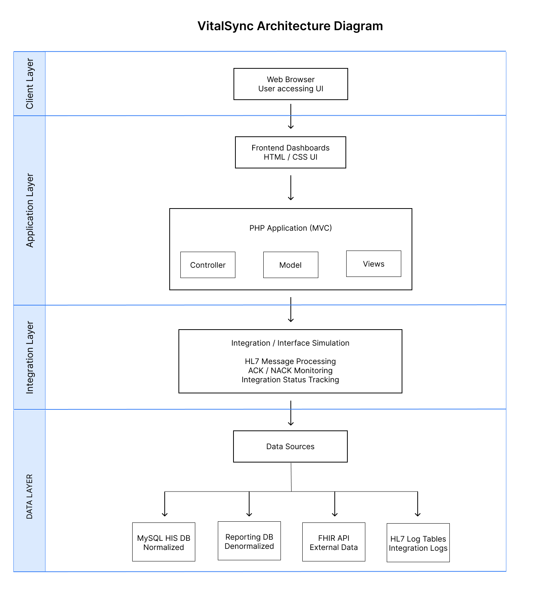
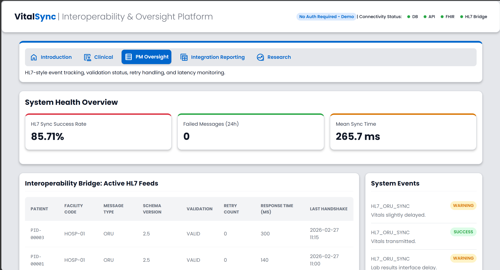
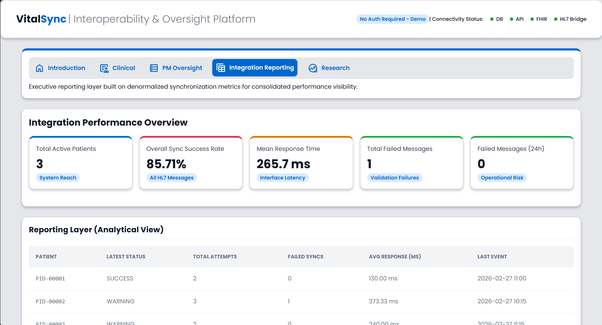
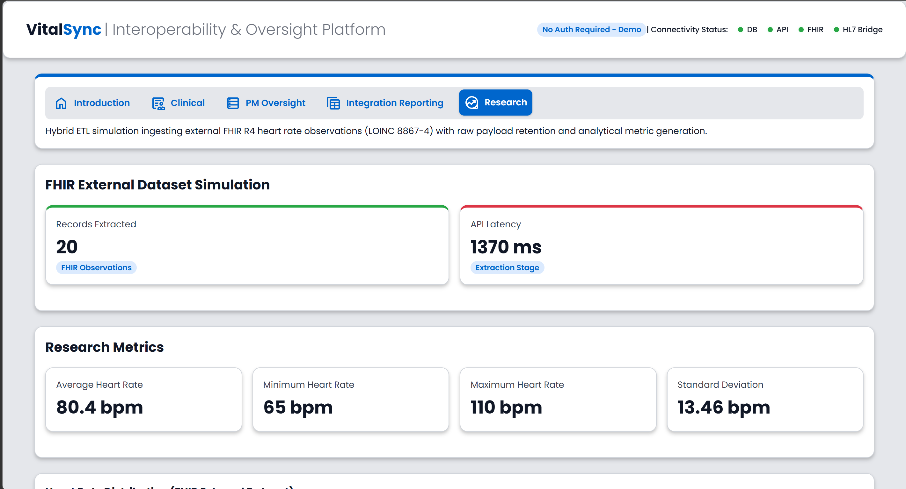
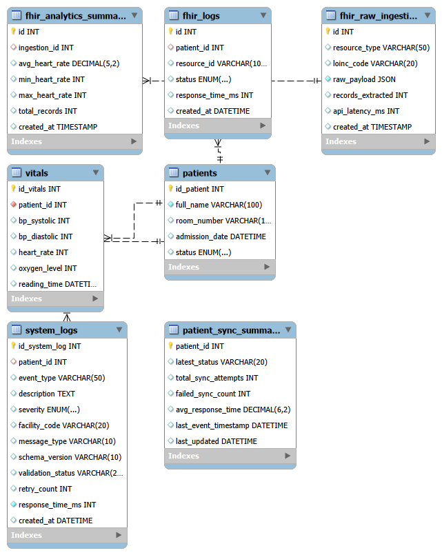

# VitalSync Platform

Healthcare Interoperability & Operational Oversight Demo

VitalSync is a platform that models how systems monitor data flows, integration health, and interoperability across distributed environments.

It focuses on a core system challenge: providing visibility into how data moves across multiple systems, including transactional sources, integration layers, and reporting outputs.

---

## Table of Contents

- [Live Demo](#live-demo)
- [Key Features](#key-features)
- [System Health Metrics](#system-health-metrics)
- [System Architecture](#system-architecture)
- [Platform Architecture](#platform-architecture)
- [Data Simulation & Interoperability Model](#data-simulation--interoperability-model)
- [Dashboard Views](#dashboard-views)
- [Data Model](#data-model)
- [Design System](#design-system)
- [Technologies Used](#technologies-used)
- [System Relevance](#system-relevance)
- [Purpose of the Project](#purpose-of-the-project)
- [Author](#author)
- [License](#license)

---

## Live Demo
https://vitalsync.smarterspec.tech/
Demo credentials are not required. All platform functionality is simulated for demonstration purposes.

---

## Key Features

- Operational dashboards for system oversight
- System health monitoring indicators
- Integration and synchronization status tracking
- Simulated interoperability workflows
- Clinical, project management, and integration reporting views
- End-to-end visibility across simulated data pipelines and system interactions

---

## System Health Metrics

VitalSync includes KPI-based system health indicators to simulate real-world monitoring thresholds. Dashboard metrics dynamically change state based on predefined ranges:
- HL7 Sync Success Rate
- Failed Messages (24h)
- Mean Sync Time
- API Response Time (FHIR)

Each metric is categorized into healthy, warning, and critical states, enabling quick identification of system performance issues.

---

## System Architecture

The VitalSync platform follows a lightweight MVC architecture. The Controller manages application logic and request handling, coordinating between data models and dashboard views.

The Model interacts with internal data stores and simulated integrations, including database queries and system health checks.
The View layer presents dashboards and visualizes system behavior and integration status.

---

## Platform Architecture

VitalSync follows a lightweight MVC-style structure:
public/
  Application entry point and public assets

app/
  controllers/ → request handling and application logic
  models/ → data queries and system health checks
  views/ → dashboard UI templates
  views/layout/ → reusable UI components

docs/
  project & architecture documentation

---
## Data Model Design
Designed a relational schema with separation between:
- transactional data (patients)
- event logs (system_logs, fhir_logs)
- reporting layer (patient_sync_summary)

Implemented denormalized reporting table to support fast KPI dashboards.
Structured system to support:
- event tracking (HL7-style logs)
- auditability (FHIR payload storage)
- performance monitoring (response time, retries)

Applied read-model separation pattern (CQRS-style) for scalable reporting.

---

## Data Simulation & Interoperability Model
VitalSync simulates a multi-system healthcare environment where operational dashboards must monitor data coming from different sources.

The platform demonstrates three common data patterns found in healthcare and enterprise systems:

**Hospital Information System (HIS)**
- Simulated using a normalized MySQL database
- Stores core operational data such as patients, admissions, and vitals
- Represents transactional system-of-record data

**Research Data**
- Simulated using a public FHIR R4 API
- Demonstrates interoperability with external healthcare data services
- Represents external clinical data exchange

**Operational Reporting**
- Simulated using denormalized reporting tables
- Represents analytics-ready datasets typically used for dashboards and reporting

**HL7 Integration Logs**
- Simulated using integration log tables
- Represents message exchange monitoring between systems
- Demonstrates how operational platforms track message status, errors, and synchronization events across healthcare interfaces

This architecture highlights how operational platforms often integrate data across multiple systems and formats to provide a unified monitoring interface.

---

## Dashboard Views

| Clinical Dashboard | PM Oversight |
|----------------|---------------|
|  |  |

| Integration Reporting | Research Dashboard |
|-----------------------|--------------|
|  |  |

---

## Data Model

The platform uses a relational database to simulate core hospital system data, including patients, encounters, and monitoring metrics used by the operational dashboards.

---

## Design System

VitalSync uses a lightweight UI foundation defined in Figma to ensure consistent spacing, typography, and visual hierarchy across dashboards.

Key principles include:

- Consistent card spacing and grid layout
- Neutral color palette for operational dashboards
- Status indicators for system health monitoring
- Responsive layouts designed for desktop, tablet, and mobile devices
- Responsive grid layouts for KPI cards and tables

---

## Technologies Used

- PHP (MVC-style application structure)
- MySQL relational database
- HTML / CSS responsive UI
- REST API integration (FHIR R4)
- HL7 integration log simulation

---

## System Relevance

VitalSync models how real-world systems handle:
- Data movement across multiple layers (transactional, integration, reporting)
- Monitoring of system health and message flows
- Visibility into failures, delays, and synchronization issues

These are core requirements in environments where reliability, traceability, and system observability are critical.

---

## Purpose of the Project

This project demonstrates how systems provide visibility into data flows, integration health, and system reliability across multiple services.

It models how fragmented data sources can be unified into observable, traceable workflows, enabling better monitoring and operational decision-making.

---

## Project Status

Current version focuses on:

- Simulated healthcare data interoperability workflows
- Operational dashboards for system health monitoring
- Integration status tracking and message monitoring
- Lightweight MVC architecture for modular application structure

Future improvements may include:

- Expanded dashboard analytics
- Enhanced API integration examples
- Authentication and user roles
- Additional interoperability scenarios

---

## Author

Portfolio project created by Alejandra Badia

