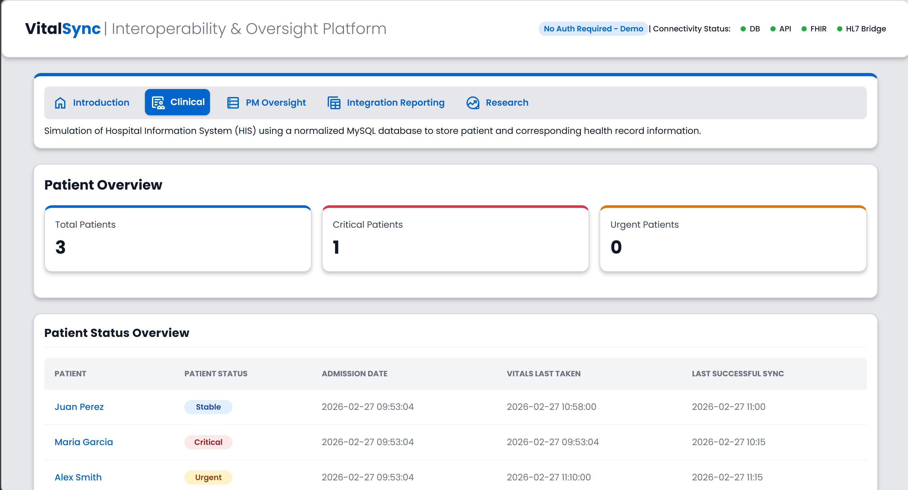

# VitalSync Platform

Healthcare Interoperability & Operational Oversight Demo

VitalSync is a demonstration platform that simulates operational monitoring and interoperability workflows within healthcare systems. The project showcases how technical dashboards and system health monitoring tools can provide visibility into integrations between clinical systems and external APIs.

This project was developed as part of a technical portfolio to demonstrate concepts in operational platforms, data monitoring, and interoperability oversight.

---

## Table of Contents

- [Live Demo](#live-demo)
- [Key Features](#key-features)
- [System Architecture](#system-architecture)
- [Platform Architecture](#platform-architecture)
- [Data Simulation & Interoperability Model](#data-simulation--interoperability-model)
- [Dashboard Views](#dashboard-views)
- [Data Model](#data-model)
- [Design System](#design-system)
- [Technologies Used](#technologies-used)
- [Purpose of the Project](#purpose-of-the-project)
- [Author](#author)
- [License](#license)

---

## Live Demo
https://vitalsync.smarterspec.tech/
Demo credentials are not required. All platform functionality is simulated for demonstration purposes.

---

## Key Features

- Operational dashboards for system oversight
- System health monitoring indicators
- Integration and synchronization status tracking
- Simulated interoperability workflows
- Clinical, project management, and integration reporting views

---

## System Architecture

The VitalSync platform follows a lightweight MVC architecture. Controller manages application logic, including request handling and determine which dashboard view should be displayed. The model interacts with internal data stores and simulated integrations, including database queries and system health checks. The views are responsible for presenting the dashboard interface and visualizing operational monitoring data.

---

## Platform Architecture

VitalSync follows a lightweight MVC-style structure:
public/
  Application entry point and public assets

app/
  controllers/ → request handling and application logic
  models/ → data queries and system health checks
  views/ → dashboard UI templates
  views/layout/ → reusable UI components

docs/
  project & architecture documentation

---

## Data Simulation & Interoperability Model

VitalSync simulates a multi-system healthcare environment where operational dashboards must monitor data coming from different sources.

The platform demonstrates three common data patterns found in healthcare and enterprise systems:

**Hospital Information System (HIS)**
- Simulated using a normalized MySQL database
- Stores core operational data such as patients, admissions, and vitals
- Represents transactional system-of-record data

**Research Data**
- Simulated using a public FHIR R4 API
- Demonstrates interoperability with external healthcare data services
- Represents external clinical data exchange

**Operational Reporting**
- Simulated using denormalized reporting tables
- Represents analytics-ready datasets typically used for dashboards and reporting

**HL7 Integration Logs**
- Simulated using integration log tables
- Represents message exchange monitoring between systems
- Demonstrates how operational platforms track message status, errors, and synchronization events across healthcare interfaces

This architecture highlights how operational platforms often integrate data across multiple systems and formats to provide a unified monitoring interface.

---

## Dashboard Views

| Home Dashboard | Clinical View |
|----------------|---------------|
|  |  |

| Integration Monitoring | PM Oversight |
|-----------------------|--------------|
|  |  |

---

## Data Model

The platform uses a relational database to simulate core hospital system data, including patients, encounters, and monitoring metrics used by the operational dashboards.

---

## Design System

VitalSync uses a lightweight UI foundation defined in Figma to ensure consistent spacing, typography, and visual hierarchy across dashboards.

Key principles include:

- Consistent card spacing and grid layout
- Neutral color palette for operational dashboards
- Status indicators for system health monitoring
- Responsive layouts designed for desktop, tablet, and mobile devices
- Responsive grid layouts for KPI cards and tables

---

## Technologies Used

- PHP (MVC-style application structure)
- MySQL relational database
- HTML / CSS responsive UI
- REST API integration (FHIR R4)
- HL7 integration log simulation

---

## Purpose of the Project

VitalSync demonstrates how operational platforms can provide visibility into system integrations and data workflows.

The platform simulates environments where organizations must monitor system health, synchronization status, and integration performance across multiple services.

---

## Author

Portfolio project created by Alejandra Badia

